# DSCNS — 动态自修改认知网络系统（Dynamic Self-Modifying Cognitive Network System）

> **状态：早期研究原型 — Phase 5 扩展自修改循环 (v0.4.0)**

DSCNS 是一个实验性研究原型，探索神经系统能否：
持续观察自身状态、修改自身参数、评估修改后果、从失败修改中学习、并在长
期运行中反复自我适应。

**Phase 5 当前聚焦内生参数自修改，而非声称通用智能或不受限的自主自我改进。**

DSCNS 是一个实验性研究原型，探索用于**持续学习**、**候选知识验证**、
**选择性内化**、**记忆**、**元认知**与**结构演化**的动态模块化神经架构。

系统围绕以下概念闭环设计：

```
经验
  → 多网络观察
  → 独立评估
  → 跨网络验证
  → 元认知决策
  → 选择性渐进内化
  → 回归测试
  → 记忆更新
  → 结构适应
  → 持续学习
```

本仓库包含当前原型实现及其实验结果（Phase 0–3）。它被定位为开放、诚实、
可复现的研究产物——**不代表**已解决持续学习、AGI 或人类级智能等问题的声明。

- [English](README.md) · [日本語](README.ja-JP.md)

---

## 概览

DSCNS 将单一的"数据 → 梯度更新"流程替换为闭环认知过程：经验被多个网络观察、
独立评估、跨网络验证，之后才被渐进内化——或作为可调用知识存储。网络拓扑本身
也被视为可学习的结构（分裂 / 合并 / 连接）。Phase 4 中，"何时/什么/哪里/改多少"
的修改*决策*由小型自修改策略网络以模仿 + 强化学习习得；Phase 5 中，每个网络的
内部状态直接产生对自身参数的连续修改量（`θ → h → Δθ → θ'`，见
[docs/PHASE5.md](docs/PHASE5.md)）。

当前原型基于**冻结的 GPT-2 small（124M）底座模型** + **每个认知网络一个
LoRA 适配器**，实现了设计文档中描述的完整验证 / 内化 / 记忆 / 元认知 / 演化栈。

## 核心思想

| 传统范式 | DSCNS 范式 |
|---|---|
| 数据 → 模型 → 梯度下降 → 固定参数 | 经验 → 多网络观察 → 独立评估 → 跨网络验证 → 选择性内化 → 结构重组 → 持续演化 |

十大设计原则（摘要）：接收信息 ≠ 学习；学习 ≠ 立即修改参数；参数更新必须经过
验证；同一经验可被多个网络观察；观察 ≠ 内化；知识可共享也可局部内化；遗忘应
局部、渐进、可重新激活；网络间可通信、纠错、建立新连接；网络结构本身是学习
结果；系统通过持续经验不断改变自身。

## 系统架构

```
        外部环境 / 经验流
              │
        经验管理层
  （经验缓冲 → 候选解析 → 主动选择）
              │ 解析后的候选
              ▼
      多网络认知层（N1 … N5）
  （共享冻结底座 + 独立 LoRA 适配器）
              │ 评估 Q_i = (R, N, C, I)
              ▼
       跨网络验证层
  （信任加权聚合 · 冲突检测与解决）
              │ 已验证知识
              ▼
        元认知控制层
  （更新决策 · 自适应学习率 · 结构演化）
              │
              ▼
        记忆与知识存储
  （情景 · 语义 · 程序）
```

## 关键机制

### 多网络表示

多个认知网络共享一个冻结底座，但持有**独立的 LoRA 适配器**，即分布式参数空间

```
Θ_t = {θ_1, θ_2, …, θ_k}
```

各网络参数独立，底座权重共享（内存高效）。

### 候选知识

新经验**不会**直接修改参数，而是先成为*候选知识*，经过评估、验证与内化决策。

### 独立评估

每个网络沿四个维度对候选打分：

```
Q_i = (R, N, C, I)
```

- **R** — 相关性（与该网络领域的相似度）
- **N** — 新颖性（与已内化知识的不相似度）
- **C** — 可信度（底座模型证据 × 来源可靠性）
- **I** — 重要性（相关性 × 不确定性驱动的效用）

### 跨网络验证

各网络置信度按信任度加权聚合：

```
w_i = trust_i × R_i，        C_final = Σ w_i·C_i / Σ w_i
```

冲突（`max(C_i) − min(C_i) > 阈值`）触发基于证据的解决；证据不足时系统
**延迟决策（defer）** 而非强行作答。网络信任权重根据观测到的正确性动态更新。

### 渐进式内化

知识通过门控循环进入网络：

```
试探更新 → 回归测试 → 接受 / 回滚
```

并带有更新预算约束

```
‖Δθ‖₂ ≤ ε·‖θ‖₂
```

使单条知识不会引起网络剧烈变化。

### 知识等级

原型逐条记录知识的内化程度：

| 等级 | 状态 |
|---|---|
| Level 1 | **广播观察** — 系统知道该知识存在 |
| Level 2 | **可调用知识** — 存入语义记忆，可查询 |
| Level 3 | **已内化知识** — 影响网络参数 |

### 记忆系统

三层功能记忆：

- **情景记忆** — 带检索的时序原始经验
- **语义记忆** — 轻量知识图谱式表示
- **程序记忆** — 按任务类型存储成功行动序列

架构*受情景/语义/程序记忆的功能区分启发*；**不**声称模拟人脑机制。

## 当前实现

| 组件 | 模块 | 设计报告章节 |
|---|---|---|
| 经验缓冲 / 候选解析 | `dscns/experience.py` | §2.1, §3.1 |
| 认知网络 + Q=(R,N,C,I) | `dscns/networks.py` | §2.1, §3.2–3.3 |
| 跨网络验证 | `dscns/verification.py` | §3.4, §8.2 |
| 渐进内化 | `dscns/internalization.py` | §3.5, §8.3 |
| 元认知控制器 | `dscns/metacognition.py` | §6 |
| 消息总线 / 通信 | `dscns/communication.py` | §8.1 |
| 三层记忆 | `dscns/memory.py` | §5 |
| 结构演化 | `dscns/evolution.py` | §4 |
| 学习式自修改（Phase 4） | `dscns/self_modification.py` | Phase-4 方案 §3–12 |
| 修改记忆（Phase 4） | `dscns/modification_memory.py` | Phase-4 方案 §13 |
| 内生可塑性（Phase 5） | `dscns/intrinsic_plasticity.py` | Phase-5 报告 §4–6 |
| 可塑性训练器（Phase 5-C） | `dscns/plasticity_trainer.py` | Phase-5 报告 §11 |
| 系统编排 | `dscns/system.py` | §7.3, §11 |
| 指标（AF/FWT/CLS） | `dscns/evaluation.py` | §7.4, §10.3 |

## 实验设置

- **底座模型：** GPT-2 small（124M），冻结，本地副本
- **网络：** 5 个认知网络（N1 世界 / N2 数学 / N3 逻辑 / N4 语言 / N5 验证），
  各带 LoRA（r=16）适配器
- **经验流：** 24 轮 = general(4) → math(4) → logic(4) → code(4) →
  science(4) → mixed(4)，每轮 32 条经验
- **预算公平：** Control / Exp1 / Exp2 每轮均为 8 个梯度步
  （Control 无条件；Exp1/Exp2 回归门控）
- **性能指标：** exp(−掩码 CE loss)；另报告生成准确率
- **硬件：** NVIDIA RTX 3070 Ti 8GB（原始实验）

## 数据集

| 领域 | 数据集 | 来源 |
|---|---|---|
| general | Wikitext-103（Wikipedia） | HuggingFace `wikitext` |
| math | GSM8K | HuggingFace `gsm8k` |
| logic | MATH-500（回退） | HuggingFace `HuggingFaceH4/MATH-500` |
| code | HumanEval | HuggingFace `openai/openai_humaneval` |
| science | SciQ | HuggingFace `allenai/sciq` |

> 说明：`hendrycks/competition_math` 需要数据集访问授权；加载器会自动回退到
> 公开的 MATH-500。

**模型权重与数据集缓存有意不纳入版本控制**，可通过提供的脚本自动下载
（见[复现](#复现)）。

## 实验结果

详细数字见 `experiments/comparison.md` 与 `REPORT_zh.md`（中文复现报告）。摘要：

| Phase | 实验 | 结果 |
|---|---|---|
| Phase 1 | 多网络持续学习 | 混合结果——并非一致优于 Control |
| Phase 1 | 渐进内化（Exp1/Exp2） | **降低遗忘**（AF 0.0037 → 0.0010 / 0.0013） |
| Phase 1 | 前向迁移（Exp2） | 三个模式中唯一为正（+0.0013） |
| Phase 2 | 信息增益采样 | 所测策略中最佳（0.0591 vs 随机 0.0572） |
| Phase 3 | 动态拓扑（分裂/合并/连接） | 机制可运行；当前低于固定拓扑 |
| Phase 4 | 学习式结构自修改 | 策略从自状态学习结构决策（见下文） |
| Phase 5 | 内生式参数自修改 | 闭环 `θ→h→Δθ→θ'` 存在、稳定、状态依赖（见下文） |

### Phase 1 — 持续学习（Control / Exp1 / Exp2）

| 指标 | Control | Exp1 | Exp2 |
|---|---|---|---|
| 平均遗忘 AF ↓ | 0.0037 | **0.0010** | 0.0013 |
| 前向迁移 FWT ↑ | 0.0002 | −0.0041 | **+0.0013** |
| 综合持续学习分 CLS ↑ | **0.0868** | 0.0735 | 0.0565 |
| 平均获取 ↑ | 0.0942 | 0.0725 | 0.0548 |
| 平均保留 ↑ | **0.0905** | 0.0745 | 0.0578 |

*Control = 顺序微调；Exp1 = 单网络 + 选择性内化；Exp2 = 5 网络 + 跨网络验证。*

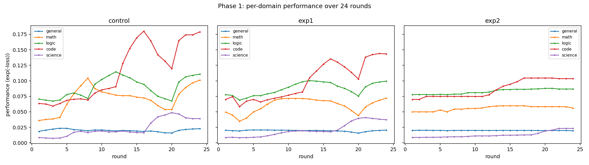
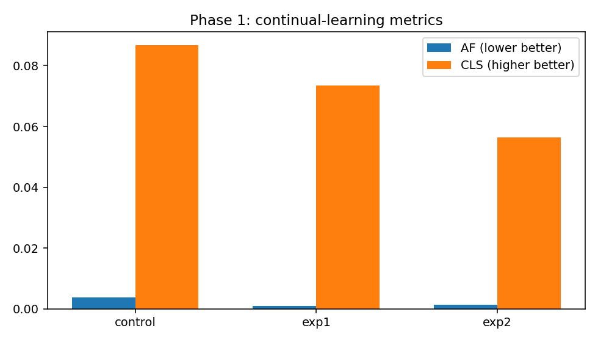

### Phase 2 — 主动学习

| 策略 | 最终性能 | 最终覆盖度 |
|---|---|---|
| random（基线） | 0.0572 | 0.256 |
| uncertainty | 0.0466 | 0.256 |
| **info_gain** | **0.0591** | 0.256 |
| meta | 0.0561 | 0.256 |

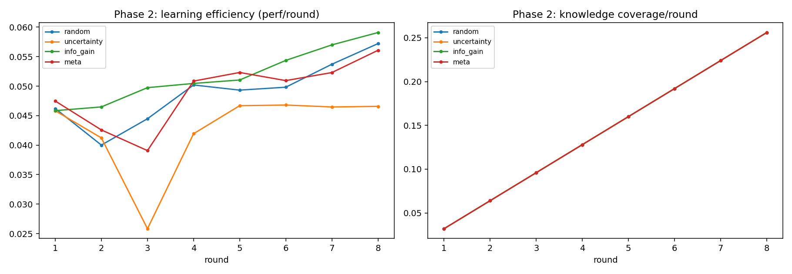

### Phase 3 — 结构演化

| 指标 | fixed | evolve |
|---|---|---|
| 最终平均性能（5 域） | **0.0575** | 0.0533 |
| 代码域适应（round 4→7 Δ） | **+0.0130** | +0.0041 |
| 最终网络数 | 5 | 5 |

观测到的演化事件：合并（round 7）、分裂（round 9）、分裂（round 11）、
合并 + 动态连接（round 13）。

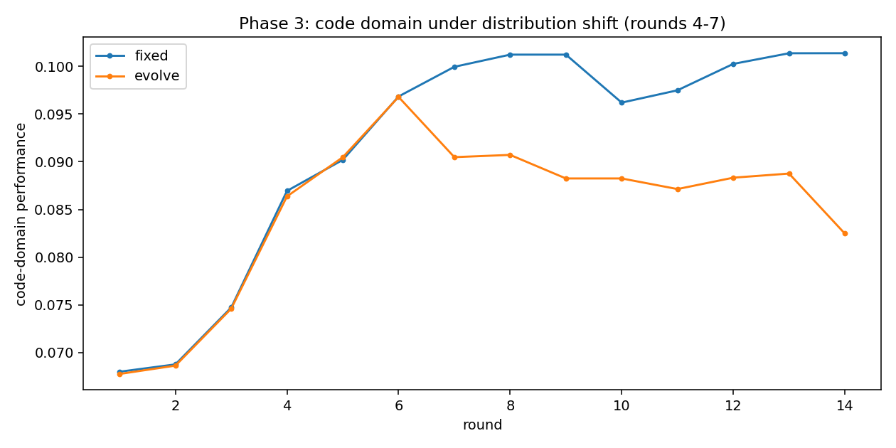

### Phase 4 — 学习式结构自修改（rule vs learned vs fixed）

在分布漂移流（general(4)→code(4)→mixed_code(4)→science(4)，16 轮）上对比
三种控制器。`rule` 与 `learned` 使用相同的"候选→评估→接受/回滚"机制，
唯一区别是**由谁决策**结构动作（人工规则 vs 训练得到的策略）。

| 指标 | fixed | rule | learned |
|---|---|---|---|
| 最终平均性能（5 域） | 0.0554 | 0.0570 | **0.0585** |
| 平均遗忘 AF ↓ | **0.0000** | 0.0099 | 0.0029 |
| 前向迁移 FWT ↑ | 0.0005 | **0.0009** | 0.0007 |
| 综合持续学习分 CLS ↑ | 0.0553 | 0.0471 | **0.0556** |
| 代码域适应（r4→8 Δ） | +0.0224 | +0.0326 | **+0.0336** |
| 最终网络数 | 5 | 2 | 2 |
| 修改成功率 | — | 1.00 | 1.00 |
| 修改平均奖励 | — | — | −0.0031 |

本单种子运行中，learned 控制器取得最高最终平均性能、最高 CLS 与最佳代码域
适应，遗忘低于 rule 控制器；learned 策略在 Stage B 自主提出结构修改
（r11 合并），动作熵随学习下降（行为变化）。**注意：** 单种子、原型尺度，
差异（≈0.003）不构成统计显著结论；奖励信号轻微为负，策略比原始规则引擎
更保守。

设计与完整讨论见 [docs/PHASE4.md](docs/PHASE4.md)。

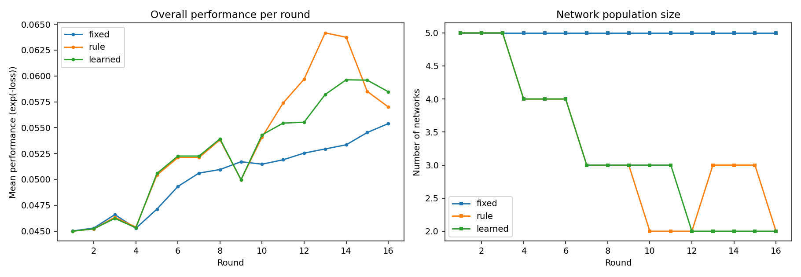
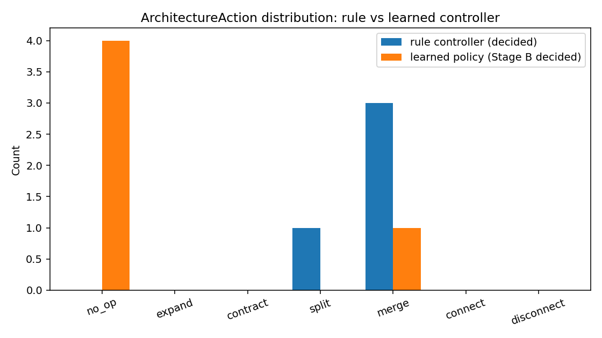
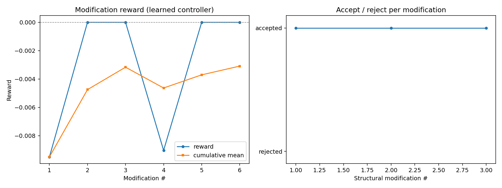
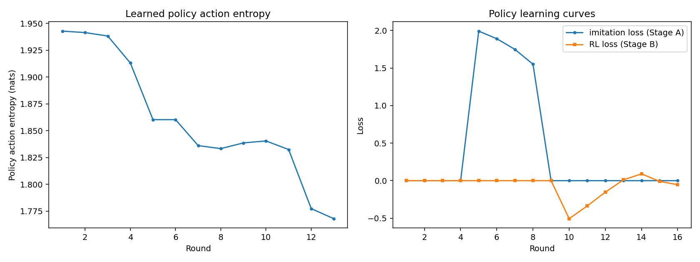

### Phase 5 — 内生式参数自修改（θ → h → Δθ → θ'）

每个认知网络携带一个 `IntrinsicPlasticityModule`（作为网络的**成员**），
将自身内部状态映射为连续参数变化。P5 的核心命题是"参数—状态反馈闭环"的
存在性、稳定性、状态依赖性与可区分性；**性能为描述性指标，不作为证明**
（遵循设计报告）。20 轮漂移流（general(5)→code(5)→mixed_code(5)→science(5)）：

| 指标 | fixed | p5b (内生) | random | constant | shuffled |
|---|---|---|---|---|---|
| 最终平均性能（5 域） | **0.0413** | 0.0412 | 0.0405 | 0.0409 | 0.0407 |
| 平均遗忘 AF ↓ | **0.0090** | 0.0090 | 0.0097 | 0.0094 | 0.0095 |
| 持续学习分 CLS ↑ | **0.0323** | 0.0322 | 0.0308 | 0.0315 | 0.0312 |
| 触发次数 / 接受率 | — | 100 / 1.00 | 100 / 1.00 | 100 / 1.00 | 100 / 1.00 |
| Δθ 平均范数 | — | **1.285** | 1.310 | 1.325 | 1.288 |
| Δθ 范数方差 | — | **4.8e-3** | 1.3e-2 | 3.3e-3 | 1.8e-3 |
| 预测变化率 | — | **0.014%** | 0.019% | 0.012% | 0.007% |

核心验证（单种子，全部通过）：Δθ 非零（‖ΔW_A‖≈0.67，‖ΔW_B‖≈0.69）、
状态依赖（同输入确定性为 0；跨输入差异 ≈0.23）、参数转换（‖θ'−θ‖≈32.7）、
行为改变（logits 差 ≈0.21）、闭环非恒定且不发散、连续 20 步稳定（无 NaN，
熵 ≈3.87）；与随机/固定/打乱 Δθ 可区分。在同等 Δθ 范数下，内生 Δθ 的
跨事件方差**最低**、行为扰动**最小**——与"状态对齐的结构化修改"一致。

**P5-C**（离线自适应可塑性学习）单独报告于 [docs/PHASE5.md](docs/PHASE5.md)
§5.4：机制完整运行（100 次触发、每网络 19/20 成功案例与 11 次训练、平均
奖励 +9.6e-4），但奖励加权离线信号（≈1e-9）在本尺度下可忽略，未观察到
可测量的可塑性改进；其更高性能被额外适应计算混淆。

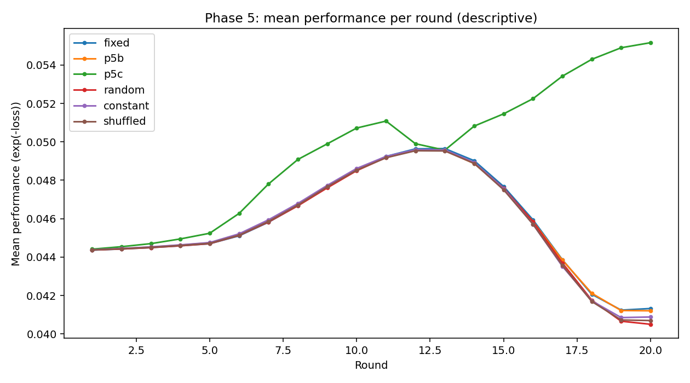
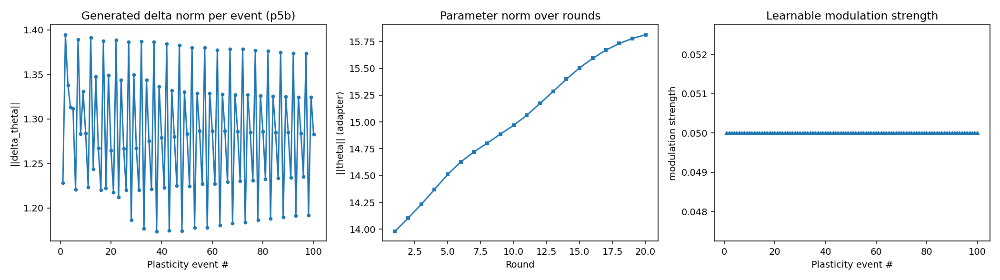
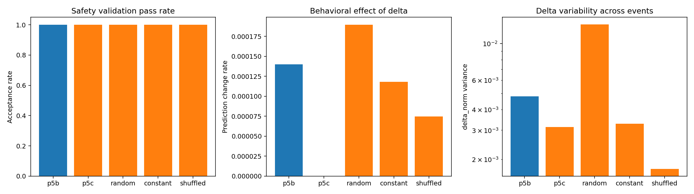
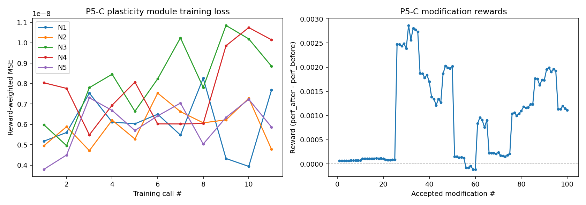

### Phase 5 — 长期内生参数自修改（150 轮）

150 轮长期实验：见 `docs/PHASE5_LONG_RUN.md`。

## 当前发现

以下发现是**初步的**，仅限于本原型及其实验设置，不应被解读为关于持续学习或
神经架构设计的普适结论。

1. **发现 1** — 在固定计算预算下，多网络协作*不会*自动提升绝对性能。
2. **发现 2** — 渐进内化在降低灾难性遗忘方面*显示出前景*（AF：0.0037 →
   0.0010 / 0.0013；各领域遗忘率一致更低）。
3. **发现 3** — 基于信息增益的经验选择在测试设置下*优于随机选择*。
4. **发现 4** — 动态拓扑演化目前*不足以超越固定拓扑*，需要更好的结构可塑性
   控制（观测到分裂/合并期间的短期性能扰动，与设计报告风险分析一致）。
5. **发现 5（Phase 4）** — 由规则模仿 + REINFORCE 训练的小型策略*可以*仅依据
   系统自身状态产生结构修改决策（无需规则引擎）；是否*优于*规则或固定拓扑，
   在本原型尺度上尚未确立（见 [docs/PHASE4.md](docs/PHASE4.md) 与
   `experiments/phase4`）。
6. **发现 6（Phase 5）** — 模型内部状态*可以*直接产生依赖自身状态、稳定、
   可测量的参数变化（`θ → h → Δθ → θ'`）；闭环通过 Test 1-6，且与随机/固定/
   打乱修改可区分——**不声称**性能提升（见 [docs/PHASE5.md](docs/PHASE5.md)
   与 `experiments/phase5`）。

## 复现

环境：Python 3.8.16、PyTorch 1.13.1、CUDA 11.7
（`transformers==4.45.2`、`datasets==2.21.0`、`peft==0.12.0`、
`accelerate==0.34.2`、`huggingface_hub==0.25.2`、`tokenizers==0.20.1`；
见 `requirements.txt`）。原始实验在 NVIDIA RTX 3070 Ti 8GB 上完成。

```bash
# 1) 下载底座模型（GPT-2 small）— 约 550 MB
python scripts/download_model.py

# 2) 准备数据集（下载并缓存到 data/）
python -c "from scripts.common import make_config, prepare_data; \
           d = prepare_data(make_config()); print({k: len(v) for k, v in d['train'].items()})"

# 3) Phase 1 — 持续学习（Control / Exp1 / Exp2）
python scripts/run_phase1.py --modes control exp1 exp2 --out experiments/phase1

# 4) Phase 2 — 主动学习
python scripts/run_phase2.py --out experiments/phase2

# 5) Phase 3 — 结构演化
python scripts/run_phase3.py --out experiments/phase3

# 6) Phase 4 — 学习式结构自修改（rule vs learned vs fixed）
python scripts/run_phase4.py --out experiments/phase4

# 7) Phase 5 — 内生式参数自修改
#    (a) 核心验证：Test 1-6 + 负对照
python scripts/validate_phase5.py
#    (b) 主实验：fixed vs intrinsic (p5b) — 20 轮
python scripts/run_phase5_b.py --out experiments/phase5
#    (c) 负对照臂：随机 / 固定 / 打乱 Δθ
python scripts/run_negative_controls.py --out experiments/phase5
#    (d) P5-C：自适应可塑性学习
python scripts/run_phase5_c.py --out experiments/phase5
#    (e) 分析表 + 图
python scripts/analyze_phase5.py --out experiments/phase5

# 8) 汇总结果到 experiments/comparison.md + 图
python scripts/make_report.py
```

受限网络说明：若 HuggingFace Hub 或 PyPI 不可达，仓库提供了可断点续传的
解析/下载脚本（`scripts/resolve_deps.py` + `scripts/download_wheel.py`），
原始环境即通过本地代理用该方案引导安装。

## 项目结构

```
dscns/
├── dscns/                  # 核心实现（19 个模块，含 Phase 4+5）
├── scripts/                # 下载 / 实验 / 报告脚本
├── config/                 # phase1.yaml, phase5.yaml
├── tests/                  # Phase 5 验证套件（Test 1-6 + 负对照）
├── docs/                   # 设计、实验、局限、许可、PHASE4、PHASE5
├── experiments/            # 正式结果（JSON + 图）— 纳入版本控制
├── REPORT_zh.md            # 中文复现报告
├── requirements.txt
├── LICENSE                 # GPL-3.0（代码）
└── README(.zh-CN/.ja-JP).md
```

`models/`、`data/`、`wheelhouse/` 为本地缓存，由 `.gitignore` 排除在版本控制外。

## 设计说明

- 实现遵循 DSCNS 设计报告 v1.0（英文设计摘要见 `docs/DESIGN.md`）。
- Phase 4 遵循设计报告修改方案《DSCNS 自主神经结构自修改机制》（见
  `docs/PHASE4.md`）：结构修改*决策*由策略学习
  （`SelfModificationPolicy`，模仿 + REINFORCE），`StructureEvolver` 保留
  执行与硬安全约束。
- Phase 5 遵循设计报告《DSCNS Phase 5 内生式参数自修改机制》（见
  `docs/PHASE5.md`）：网络内部状态直接产生连续参数变化
  （`IntrinsicPlasticityModule`，`θ → h → Δθ → θ'`）；触发/验证/回滚
  归属实验控制器。
- 多网络 = 共享冻结底座 + 每网络 LoRA 适配器，参数空间 Θ_i 独立、记忆共享。
- 逐条记录知识状态等级与内化度 I_ij ∈ [0,1]，保证可追溯性。
- 与设计报告的已知偏差记录于 `docs/EXPERIMENTS.md`（§7）与 `docs/LIMITATIONS.md`。

## 局限

- 模型规模小（124M 底座）且数据预算有限。
- 多网络实验受严格的计算预算公平约束。
- 结构演化机制刻意保持简单；Phase 4 的学习式控制器是小型策略 + 极小 RL
  预算（概念验证，而非可扩展的架构搜索）。
- Phase 5 的内生可塑性仅在原型尺度验证（单种子、GPT-2 small、单 LoRA 秩、
  外部固定触发）；**不声称**其带来性能提升。
- 未进行大规模基准测试；尚无证据表明可泛化到其他模型或领域。
- 尚无证据表明 DSCNS 普遍优于成熟持续学习方法（EWC、经验回放等）。
- 完整列表见 `docs/LIMITATIONS.md`。

## 未来工作

- 更长的训练周期与更大预算，重新检验假设 H1/H2。
- 学习式（而非手工调参的）相关性与信任权重函数。
- Phase 4：更大 RL 预算、更长适应窗口、层级（而非仅 adapter 群体级）
  学习式自修改。
- Phase 5：端到端可微可塑性、学习式触发（Level 4）、完整参数条件化、
  多层协同；下一阶段为 Phase 6（内生*结构*自修改）。
- 更好的结构可塑性控制（自适应演化阈值、演化后稳定调度）。
- 更大规模基准（EWC / 回放 / PEFT 基线）。
- 多模态与开放环境扩展（设计报告 Phase 6+）。

## 引用

若在研究中使用了本仓库，请引用：

```bibtex
@misc{dscns2026,
  title  = {DSCNS: Dynamic Self-Modifying Cognitive Network System -- A Research Prototype},
  author = {Mousennnn},
  year   = {2026},
  month  = {aug},
  note   = {Version v0.4.0, early research prototype},
  howpublished = {GitHub repository},
  url    = {https://github.com/Mousennnn/DSCNS-Dynamic-Self-Modifying-Cognitive-Neural-System}
}
```

## 许可

- **代码：** [GNU General Public License v3.0](LICENSE)
- **设计文档与实验报告**（`docs/`、`REPORT_zh.md`、`experiments/comparison.md`）：
  [CC BY 4.0](https://creativecommons.org/licenses/by/4.0/) — 见 `docs/LICENSE-docs.md`。

**署名要求：** 复用或改编文档时，请注明：

> DSCNS — Dynamic Self-Modifying Cognitive Network System (v0.4.0)，作者
> Mousennnn，CC BY 4.0 许可。
> https://github.com/Mousennnn/DSCNS-Dynamic-Self-Modifying-Cognitive-Neural-System

---

*这是一个早期研究原型。实验结果如实报告，包括负面或混合发现。*
